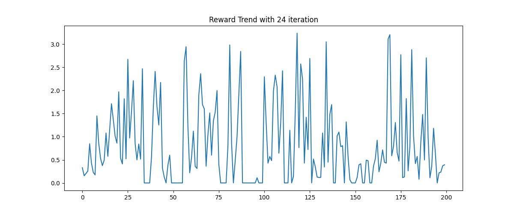
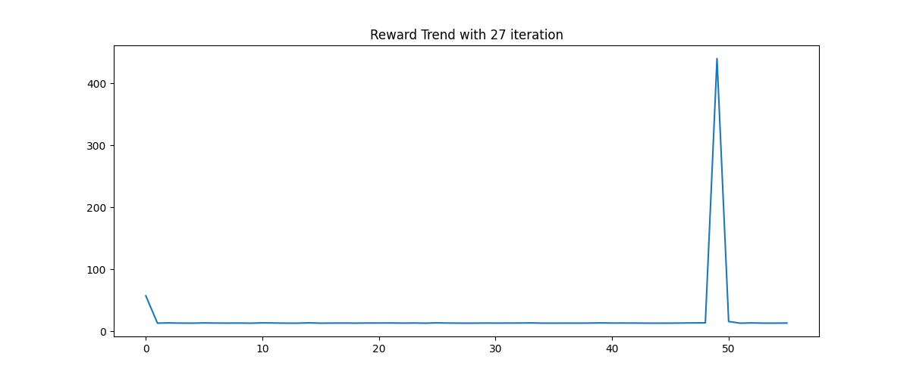
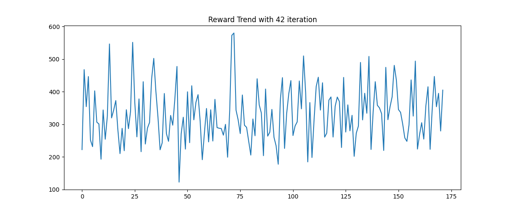

# MPC - Model Predictive Control - EI339

We implemented 3 optimzier function:

1. **ABC**

2. **Random Shooting**

3. **Simulated Annealing**

And we tried over 20 experiments. (Without GPU resources)

## Overview of the experiment results:

We tried different hyperparameters in different environment. **Using ABC optimizer.**

The best result we achieved is list in the table.

| Environment  | Batchsize |Horizon  |  Max n step  |  Gamma  |  Episode reward | Picture |
| --------   | -----:  | :----: | :----: | :----: |  :----: | :------:   |
| Qube      |  64   |  30  | 500 |  0.98  | 3.0+ |  |
| CartPoleSwing |  256  | 30  | 1000 |  0.99  | 400+ |  |
| BallBalancer | 512 | 5 | 1000 |  0.999  | 600 |  |

